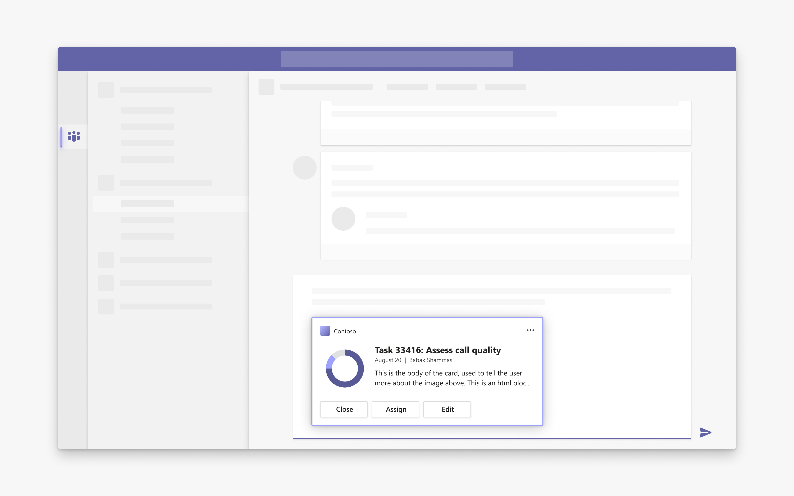

# Designing your Microsoft Teams app

Well-designed Microsoft Teams apps make conversations smoother and more meaningful, focus on core activities, and are inclusive and accessible.

These guidelines provide UI toolkits, samples, and best practices to help you quickly design an app that feels native to Teams and, most importantly, allows people to collaborate and be more productive.

> [!NOTE]
> These guidelines are primarily for designing desktop apps.

## Before you begin

You can't design a great app without a fundamental understanding of what your app is trying to do and how you think people will use it. Before opening your design tools, make sure you know your app's use cases, understand how those fit with Teams capabilities, and determine if the app will be used by groups, individuals, or both. [INCLUDE LINKS HERE]

## Creating a cohesive look and feel

Apps extend Teams features and functionality with one or more available platform [capabilities](../concepts/capabilities-overview.md). Your app can present these capabilities—whether it's a tab, messaging extension, bot, or webhook—with common and Teams-specific UI components.

Designing your app requires having an idea what UI works for certain capabilities (and what doesn't). For example, while multi-level navigation works for most websites, it isn't an ideal experience in a Teams tab.

Along those lines, your design must thread UI components together in a way that feels natural not only to users but also within Teams. This is especially true if your app has more than one capability.

:::row:::
   :::column span="2":::

### Tabs

   Tabs are canvases for web-based content. But unlike a standard web app or website, they work best when displaying a small set of data or tasks.

   

   :::column-end:::
   :::column span="2":::

### Messaging extensions

   Messaging extensions are here's some text and more and some more

   

   :::column-end:::
:::row-end:::

## Resources

* Tool kit – resources & assets (most WIP)
* Adaptive card designer: https://adaptivecards.io/designer/
* UI components – Stardust site (https://fluentsite.z22.web.core.windows.net/)
* Platform high value components (WIP)
